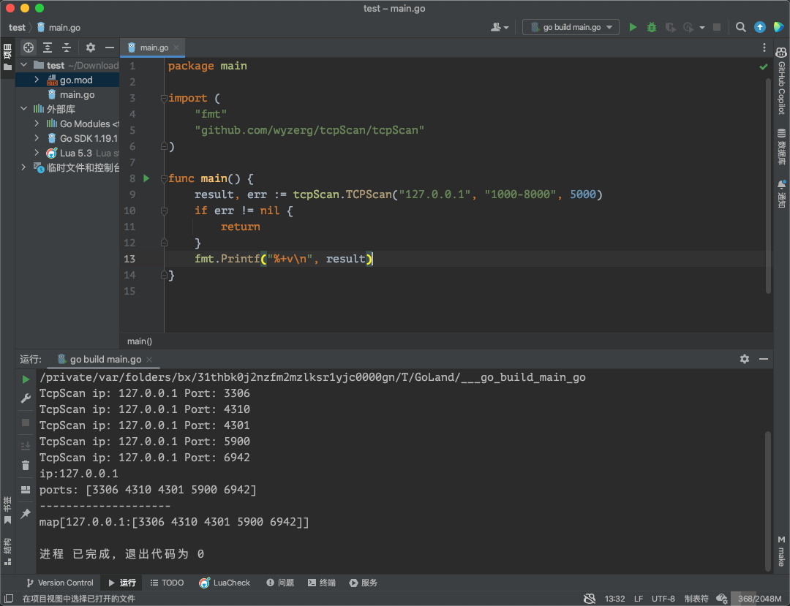

## TCP全连接端口扫描库

### ip解析字符串写法支持：

- 10.0.0.1
- 10.0.0.0/24
- 10.0.0.*
- 10.0.0.1-10
- 10.0.0.1，10.0.0.5-10，192.168.1.∗，192.168.10.0/24

### ports解析字符串写法支持:

- 80
- 80-90
- 80,90,8080-9090

### 示例参考 scan/xx_test.go文件

### 下载依赖：

```shell
go get github.com/wyzerg/tcpScan/tcpScan
```

### 代码参考

```go
package main

import (
	"fmt"
	"github.com/wyzerg/tcpScan/tcpScan"
)

func main() {
	// goroutine携程并发数 5000
	result, err := tcpScan.TCPScan("127.0.0.1", "1000-8000", 5000)
	if err != nil {
		return
	}
	fmt.Printf("%+v\n", result)
}

```

```shell
go mod tidy
```
